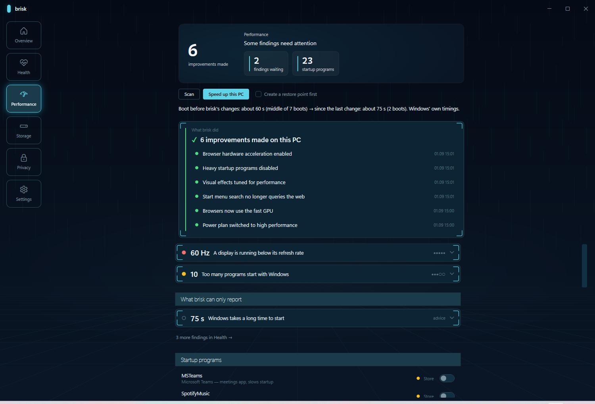

<p align="center">
  <picture>
    <source media="(prefers-color-scheme: dark)" srcset="docs/media/logo-dark.svg">
    
  </picture>
</p>

# brisk

**A free, open-source CCleaner alternative for Windows. It tells you *why* your PC is slow, and it refuses to claim anything it did not measure.**

*The tool that tells you the truth about your Windows PC.*

[](https://github.com/merturl4576/brisk/actions/workflows/ci.yml)
[](https://github.com/merturl4576/brisk/releases)
[](LICENSE)


No installer. No account. No telemetry. No AI in the product. Every diagnosis is a deterministic rule you can read in the source, and every finding carries the evidence it was built from.

[Türkçe README](README.tr.md)


*The maintainer's own machine, 2026-09-03. Counts, never contents: 375 program records, 2 USB devices, Recall's state unreadable on this build. The bottom band is the read-back: four switches brisk turned off two days ago still read as off, and for the fifth brisk says it cannot tell whether this edition of Windows acts on the policy, instead of saying "done".*

---

## Install

One line, if you trust it. You should not have to, so the script is [44 readable lines](get.ps1). It downloads the latest release, **refuses to run it unless the SHA-256 digest matches** the one published beside it, and unpacks into one folder. Uninstall means deleting the folder.

```powershell
irm https://raw.githubusercontent.com/merturl4576/brisk/main/get.ps1 | iex
```

Or do it by hand: download **`brisk-app.exe`** from [Releases](https://github.com/merturl4576/brisk/releases) and run it. One file. Nothing is installed. Nothing is written to your machine until you tell brisk to fix something, and every change is recorded so it can be undone.

Prefer a terminal? Download **`brisk.exe`** instead. Same diagnostics, no elevation prompt, `--json` included.

```
brisk scan
```

Neither file needs .NET installed, and neither needs the other. Verify your download against `SHA256SUMS.txt` in the same release.

> brisk is not code-signed yet, so SmartScreen will warn the first time. That warning is fair. Trust the checksum, not this sentence.

---

## What a scan actually looks like

Real output from the maintainer's machine, not a mockup:

```
[! ] Too many programs start with Windows (impact ***)
    13 programs start with Windows. Heavy ones that can be started manually
    instead: WhatsAppDesktop, MSTeams.
[! ] Disk space fragmented across system folders (impact **)
    AppData\Local: 53.9 GB (over threshold); AppData\Roaming: 28.6 GB (over
    threshold); Desktop: 57.7 GB (over threshold); Downloads: 8.7 GB
[i ] temperature: CPU not read — GPU only. Memory integrity is on here, and the
     driver that reads CPU temperature is on Microsoft's vulnerable-driver
     blocklist, so Windows will not load it at any privilege level. brisk does
     not switch that off, and cannot prove it is the only reason here.
Reclaimable — Safe: 2.3 GB, Developer: 3.6 GB, Deep: 5.1 GB (run 'brisk clean')
```

The third finding is the point of the project. brisk could have printed a GPU temperature and called it "your PC". Instead it said what it could not read, why it probably could not, and that it cannot prove the reason.

---

## The read-back: brisk re-checks its own work

Every tool in this category says "done". brisk treats "done" as a claim, and claims get re-checked.

**Privacy.** When brisk turns a Windows data-collection setting off, every later scan re-reads it and reports one of four states: **Held**, **Reverted**, **WrittenButIgnored**, **WrittenButUnverified**. The third state exists because Windows Home silently ignores some policy writes. The registry says off, Windows keeps collecting. brisk tells you that instead of celebrating.

**Speed.** The same idea applied to time. brisk records when it changed something, then reads the boot timings Windows writes for itself (not a stopwatch brisk invented) and puts the two side by side on the Performance page:

> Boot before brisk's changes: about 60 s (middle of 7 boots) → since the last change: about 75 s (2 boots). Windows' own timings.

There is no causal claim in that sentence. Two measurements, their counts, and your own conclusion. That line is from the maintainer's machine today, and the number went the wrong way: a delayed startup task planted during a test made boot slower, and brisk printed it. A tool that only shows you the good number is not measuring.



*Same machine. Six changes brisk made and can undo, two findings waiting, one it can only report. The 75 s is on the far side of brisk's changes and it stays on the page.*

**What Windows knows about you.** The Privacy page reads out what your machine has been recording: every USB device ever plugged in (model and dates), how many program launches Windows has counted, whether Recall is present, and how much Delivery Optimization uploaded to other machines this month, split into local network and internet. On the maintainer's machine that counter read 302 MB, all of it LAN, zero internet. Knowing the split is the difference between a scare and a fact.


*The Overview on the same machine. 64, because a display is running below the refresh rate it supports (25 points) and ten programs start with Windows (9 points). Two measured findings carry 34 of the 36 points; everything else here is a notice, or a 2-point hygiene item. The 75 s boot leads because it is the largest measured number, and the 24.5 GB on the deep shelves is named and left alone until asked.*

---

## What brisk refuses to do

Most of this category is built on claims nobody checks. brisk's list of refusals is the product:

- **No registry cleaning.** The single most criticised feature of the tools brisk is an alternative to. It has never been shown to make a Windows machine faster, and it can break installed software.
- **No unmeasured speed promises.** brisk never says a fix made your PC faster unless it can read a number that says so. Windows keeps its own boot measurements. brisk reads those, and where it has none, it says so.
- **No inflated score.** The health score only moves far for findings brisk can measure the other side of: boot timings, the refresh rate a panel runs at, days until the disk is full. A setting brisk flips without a number to prove anyone felt it, such as the power plan or visual effects, costs 2 points whatever its stars. The whole formula is one short file, [`HealthScore.cs`](src/BriskEngine/Diagnostics/HealthScore.cs).
- **No "we stopped Windows from collecting that".** The most brisk will ever say is "this setting reads as off right now, and here is when I last checked".
- **No telemetry, no account, no cloud, no AI in the product.** Nothing leaves your machine. There is no server to send it to.
- **No silent action.** Every fix is written to an action log, and the undoable ones can be undone from the same screen that applied them.
- **No personal data on anything shareable.** The report card, the one artifact designed to be screenshotted, never carries a device name, a file path or anything else that identifies you or your hardware. That rule is enforced by tests, not by policy.
- **No fake urgency.** No red "1,247 problems found!", no countdown, no Pro version. There is nothing to upsell.

---

## What it does

- **27 deterministic diagnostic rules.** Power plan, startup load, boot time as Windows itself measured it, a display running below the refresh rate it supports, memory running below its rated speed, thermals, disk pressure, the largest files in your profile (named), ten privacy rules with the read-back above, and more. Each finding carries its evidence.
- **One-click fixes with undo.** Rules are classified Auto, Confirm or Advise. brisk never applies a Confirm rule without asking, and never offers a fix for something it only observed.
- **A cleaner that works from an allowlist**, not from a pattern. It touches caches and temp files that Windows and your applications rebuild on their own, and nothing else. Three levels: Safe, Developer, Deep.
- **Deep shelves that speak up.** Windows.old, the hibernation file, the superseded half of the component store, stale dev caches. Each is sized and named on the front page ("32 GB more sits on the deep shelves"), each sits behind its own consent, and each row states the trade-off: what comes back, what does not, what stops working.
- **A display fix you can see.** A 144 Hz monitor running at 60 Hz is common. brisk raises it, and auto-reverts after 15 seconds unless you confirm you can still see the screen.
- **Every applied fix says when you will feel it.** Most speed changes show from the next restart, so brisk says exactly that, then measures the next boots and reports them.
- **English and Turkish**, in both the app and the command line.

### Safety model

The cleaner only ever touches its allowlist. The GUI's one-click clean frees space immediately: it recycles, then purges exactly the items it just recycled, and nothing else in your Recycle Bin is touched. That one has no undo, by design, and says so before it runs. The per-level cleans and the CLI move items to the Recycle Bin and leave emptying to you. Settings and startup fixes are always undoable.

---

## Commands

```
brisk — Windows performance diagnostics and cleanup

Usage: brisk <command> [options]

Commands:
  scan                       run diagnostics + cleaner scan
    --json                   emit JSON instead of text
  fix                        apply diagnostic rule fixes
    --all                    apply every Auto rule with a finding
    --rule <id>              apply/undo a single rule
    --undo                   undo the named rule's last fix
    --yes                    actually mutate (otherwise dry-run)
  clean                      reclaim disk space
    --level <safe|developer|deep>  which cleanup level to run
    --yes                    actually delete (otherwise print plan)
  targets                    list cleanup targets
  rules                      list diagnostic rules
  version                    print the engine version
```

Without `--yes`, `fix` and `clean` print what they would do and change nothing.

---

## The questions this category has earned

PC "optimizers" are one of the most distrusted software categories on the internet, for good reasons. Those reasons deserve answers before anyone asks.

**"Snake oil. These tools never make a measurable difference."**
Usually true. That is why brisk measures: Windows' own boot timings before and after, disk bytes counted after the move actually happened, a report that says "0 B freed" when that is what happened. Where brisk has no measurement, it says so. It will not print a speed claim it cannot source.

**"Registry cleaners break machines."**
They do. brisk does not have one and never will.

**"The cleaner will eat files I care about."**
The cleaner cannot step outside its allowlist. Every path is validated against a registered template with junctions resolved, protected folders (Documents, Desktop, Pictures, OneDrive, system roots) win over any template, and deletions go through the Recycle Bin except where a row explicitly tells you otherwise and asks separately.

**"Closed-source binary that itself phones home."**
GPL-3.0, no network code, no analytics, and the source of every rule is a file you can read. The scan output tells you which rule produced every line.

**"It will flip settings behind my back."**
Dry-run is the default in the CLI (`--yes` to mutate), every change lands in an action log, undo is on the same screen, and the risky display change auto-reverts in 15 seconds unless you confirm you can still see.

**"Unsigned exe. Instant no."**
Fair. The release ships SHA-256 digests, the installer script refuses a download that does not match, and code signing via SignPath is being applied for. Until then SmartScreen's warning is honest, and so is this paragraph.

**"This was built with AI. Why should I trust it?"**
It was, in part, and the next section says exactly which part. Trust the tests, the public specs and reviews, and the source, not the author's word.

---

## How this was built

brisk was written by one person over the summer of 2026, with AI assistance. That deserves a plain statement, because "no AI" above means no AI inside the product, not none in its making.

What the maintainer owns: the product decisions, the safety rules, the architecture (a pure engine with no UI code, and a WPF shell on top of it), every refusal on this page, and every judgement about what brisk is allowed to claim. What the AI (Claude Code) did: most of the typing, under written specs, on reviewed branches.

What keeps that honest:

- Every rule is a deterministic function over fake probes, and 1391 tests pin what each one says and refuses to say.
- The specs and implementation plans that drove each wave are public under [`docs/superpowers`](docs/superpowers).
- Every change was reviewed before merge, and the commit history records its own corrections instead of rewriting them.
- Every rule and every fix ran on real machines the maintainer owns before it shipped. One of those runs showed the score moving 43 points on settings flips alone, with nothing brisk could measure having changed. That is why the score works the way it does now.

If you find a place where the code claims more than it proves, that is the bug report this project most wants.

---

## Build from source

Requires the .NET 8 SDK. Windows only: brisk reads the registry, WMI, the Windows event log and hardware sensors, so there is nothing here that could honestly run anywhere else.

```
dotnet test brisk.sln -c Release      # 1391 tests
dotnet run --project src/Brisk.Cli -- scan
pwsh -File scripts/publish.ps1        # both single-file executables into artifacts/
```

---

## Status

Pre-release, and honest about it: brisk has been verified against real hardware on the machines its maintainer owns. If a rule reads your machine wrong, that is exactly the bug report worth opening. Bring the output of `brisk scan --json`.

## License

[GPL-3.0](LICENSE). brisk stays open: anyone may use, study and change it, and anyone who distributes a changed version has to publish their source too.
