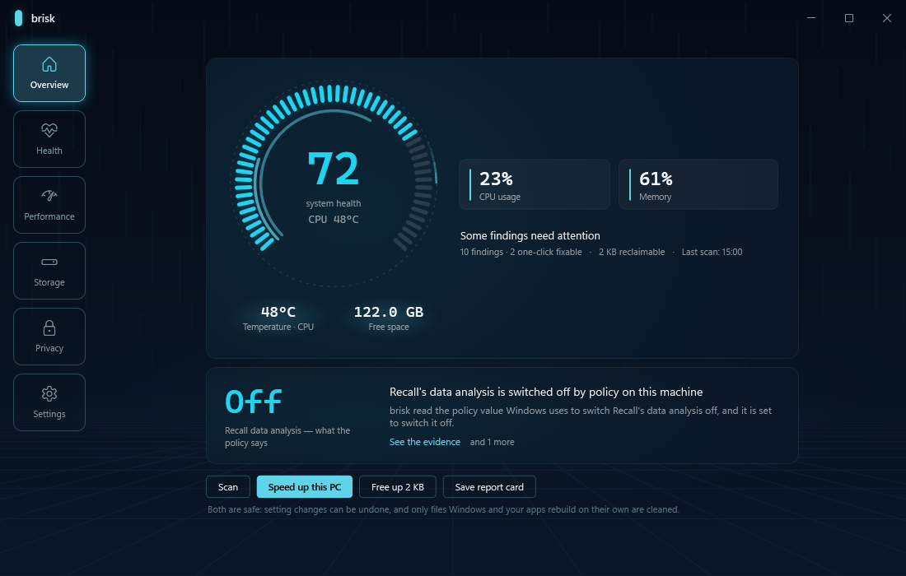
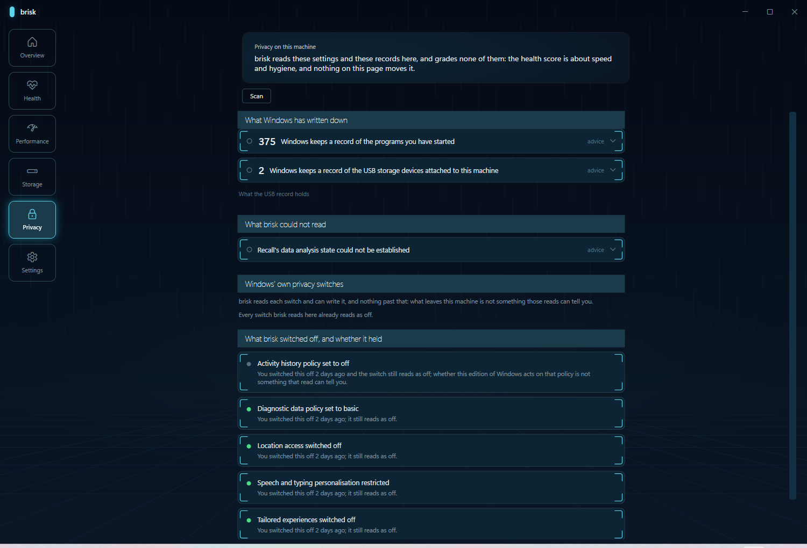

# brisk

**Windows için ücretsiz, açık kaynak CCleaner alternatifi: bilgisayarının *neden* yavaş olduğunu kanıtıyla söyler — ölçmediği hiçbir şeyi iddia etmez.**

*Windows bilgisayarın hakkında sana doğruyu söyleyen araç.*

[](https://github.com/merturl4576/brisk/actions/workflows/ci.yml)
[](https://github.com/merturl4576/brisk/releases)
[](LICENSE)


Kurulum yok. Hesap yok. Telemetri yok. Yapay zekâ yok. Her teşhis, kaynağında okuyabileceğin deterministik bir kural — ve her bulgu, dayandığı kanıtı yanında taşıyor.

[English README](README.md)



*Test süitinin ekran-dışı render düzeneğiyle, fixture verisi üzerinden çizildi — uygulamanın kullandığı kod yolunun aynısı. (Evet, "2 KB yer aç": fixture'lar küçük. Gerçek bir makinenin sayıları daha büyük ve aynı dürüstlükle kaynaklı.)*

---

## Kurulum

Tek satır — ama güvenmek zorunda kalma diye betik [41 okunur satır](get.ps1): son sürümü indirir, **SHA-256 özeti yayımlananla tutmuyorsa çalıştırmayı reddeder** ve tek klasöre açar (kaldırmak = klasörü silmek):

```powershell
irm https://raw.githubusercontent.com/merturl4576/brisk/main/get.ps1 | iex
```

Ya da elle: [Releases](https://github.com/merturl4576/brisk/releases) sayfasından **`brisk-app.exe`** dosyasını indir ve çalıştır. Tek dosya. Hiçbir şey kurulmuyor, sen "düzelt" demeden makinene hiçbir şey yazılmıyor ve değiştirdiği her şey geri alınabilsin diye kaydediliyor.

Terminali seviyorsan **`brisk.exe`** indir — aynı teşhisler, yönetici sorusu yok, `--json` dahil.

```
brisk scan
```

İki dosya da .NET kurulumu istemiyor ve hiçbiri diğerine muhtaç değil. İndirdiğini aynı sürümdeki `SHA256SUMS.txt` ile doğrulayabilirsin.

> brisk henüz imzalı değil, bu yüzden SmartScreen ilk açılışta uyaracak. O uyarı dürüst bir uyarı — bu cümleye değil, checksum'a güven.

---

## Bir tarama gerçekte neye benziyor

Mockup değil, geliştiricinin kendi makinesinden gerçek çıktı:

```
[! ] Too many programs start with Windows (impact ***)
    13 programs start with Windows. Heavy ones that can be started manually
    instead: WhatsAppDesktop, MSTeams.
[! ] Disk space fragmented across system folders (impact **)
    AppData\Local: 53.9 GB (over threshold); AppData\Roaming: 28.6 GB (over
    threshold); Desktop: 57.7 GB (over threshold); Downloads: 8.7 GB
[i ] temperature: CPU not read — GPU only. Memory integrity is on here, and the
     driver that reads CPU temperature is on Microsoft's vulnerable-driver
     blocklist, so Windows will not load it at any privilege level. brisk does
     not switch that off, and cannot prove it is the only reason here.
Reclaimable — Safe: 2.3 GB, Developer: 3.6 GB, Deep: 5.1 GB (run 'brisk clean')
```

Üçüncü satır projenin tamamının özeti. brisk bir GPU sıcaklığı basıp ona "bilgisayarının sıcaklığı" diyebilirdi. Bunun yerine neyi okuyamadığını, muhtemelen neden okuyamadığını ve **bu sebebi kanıtlayamadığını** söyledi.

---

## Read-back — brisk kendi işini yeniden kontrol eder

Bu kategorideki her araç "tamam" der. brisk, "tamam"ın bir iddia olduğu ve iddiaların yeniden kontrol edildiği fikri üzerine kurulu.

**Gizlilik:** brisk bir Windows veri toplama ayarını kapattığında, sonraki her tarama o ayarı yeniden okur ve dört durumdan birini söyler — **Held** (tuttu), **Reverted** (geri döndü), **WrittenButIgnored** (yazıldı ama umursanmadı), **WrittenButUnverified** (yazıldı, doğrulanamadı). Üçüncü durum şunun için var: Windows Home bazı ilke yazımlarını sessizce yok sayar — registry "kapalı" der, Windows toplamaya devam eder. brisk bunu kutlamak yerine söyleyen araçtır.

**Hız:** aynı DNA, zamana uygulanmış. brisk ne zaman değişiklik yaptığını kaydeder, sonra Windows'un kendi açılış ölçümlerini (kendi icat ettiği bir kronometreyi değil) okuyup ikisini Performans sayfasında yan yana koyar:

> brisk'in değişikliklerinden önce açılış: yaklaşık 59 sn (4 açılışın ortası) → son değişiklikten beri: yaklaşık 41 sn (2 açılış). Ölçüm Windows'un kendi zamanlayıcısından.

Cümlenin hiçbir yerinde nedensellik iddiası yok — iki ölçüm, sayıları ve okuyanın kendi çıkarımı.

**Windows'un senin hakkında bildikleri:** Gizlilik sayfası makinenin kaydettiklerini okur — bugüne dek takılmış her USB aygıt (model ve tarihler), Windows'un saydığı program çalıştırma kayıtları, Recall'un durumu ve Delivery Optimization'ın bu ay başka makinelere ne yüklediği, yerel ağ / internet ayrımıyla. Geliştiricinin makinesinde o sayaç 302 MB gösteriyordu — tamamı yerel ağ, internet sıfır. Ayrımı bilmek, korku ile gerçek arasındaki farktır.



*Alttaki bant, fixture verisi üzerindeki read-back: bir ayar tuttu, biri yazıldı ama umursanmadı, biri bu sürümde doğrulanamıyor, biri geri döndü — dört farklı cümle, çünkü dört farklı şey oldu.*

---

## brisk'in yapmayı reddettikleri

Bu kategori büyük ölçüde kimsenin kontrol etmediği iddialar üzerine kurulu. brisk'te asıl ürün, **reddettiklerinin listesi**:

- **Registry temizliği yok.** brisk'in alternatifi olduğu araçların en çok eleştirilen özelliği. Bir Windows makinesini hızlandırdığı hiçbir zaman gösterilemedi, buna karşılık kurulu yazılımları bozabiliyor.
- **Ölçülmemiş hız vaadi yok.** brisk, bir düzeltmenin bilgisayarını hızlandırdığını ancak bunu söyleyen bir sayı okuyabiliyorsa söyler. Windows kendi açılış ölçümlerini tutuyor; brisk onları okuyor ve elinde ölçüm yoksa "yok" diyor.
- **"Windows'un veri toplamasını durdurduk" yok.** brisk'in söyleyebileceği en fazla şey şu: "bu ayar şu an kapalı okunuyor, en son şu tarihte baktım."
- **Telemetri, hesap, bulut, yapay zekâ yok.** Makinenden hiçbir şey çıkmıyor. Gönderilecek bir sunucu yok.
- **Sessiz işlem yok.** Her düzeltme eylem günlüğüne yazılıyor; geri alınabilir olanlar da uygulandıkları ekrandan geri alınabiliyor.
- **Paylaşılabilir hiçbir şeyde kişisel veri yok.** Rapor kartı — ekran görüntüsü alınmak için tasarlanmış tek yüzey — asla aygıt adı, dosya yolu ya da seni veya donanımını tanıtan başka bir şey taşımaz. Bu kural ilkeyle değil, testlerle korunuyor.
- **Sahte aciliyet yok.** Kırmızı "1.247 sorun bulundu!" yok, geri sayım yok, Pro sürüm yok. Satılacak bir üst paket yok.

---

## Ne yapıyor

- **27 deterministik teşhis kuralı** — güç planı, başlangıç yükü, Windows'un kendi ölçtüğü açılış süresi, monitörün desteklediğinin altında çalışan ekran yenileme hızı, kendi hız değerinin altında çalışan bellek, sıcaklıklar, disk baskısı, profilindeki en büyük dosyalar, adıyla, yukarıdaki read-back'li on gizlilik kuralı ve dahası. Her bulgu kanıtını taşıyor.
- **Tek tıkla düzeltme ve geri alma.** Kurallar Auto, Confirm ve Advise diye ayrılıyor; brisk bir Confirm kuralını sormadan uygulamıyor, yalnızca gözlemlediği bir şey için düzeltme düğmesi göstermiyor.
- **Beyaz listeyle çalışan temizleyici** — desenle değil. Yalnızca Windows'un ve uygulamaların kendiliğinden yeniden ürettiği önbellek ve geçici dosyalara dokunuyor. Üç seviye: Safe, Developer, Deep.
- **Sesini yükselten derin raflar.** Windows.old, uyku modu dosyası, bileşen deposunun yeri doldurulmuş yarısı, bayat geliştirici önbellekleri — boyutlanmış, ön sayfada adıyla anılmış ("Derin raflarda 32 GB daha var"), her biri kendi onayının arkasında ve satırın üstünde takası yazıyor: ne geri gelir, ne gelmez, ne çalışmayı bırakır.
- **Gözle görülen bir düzeltme.** 144 Hz monitörün 60 Hz'de çalışması çok yaygın; brisk bu değişikliği yapıp 15 saniye içinde "görüyorum" onayı gelmezse kendiliğinden geri alıyor.
- **Uygulanan her düzeltme farkın ne zaman hissedileceğini söylüyor** — hız değişikliklerinin çoğu bir sonraki yeniden başlatmada görünür; brisk tam olarak bunu söylüyor, sonra sonraki açılışları ölçüp raporluyor.
- **İngilizce ve Türkçe** — hem uygulamada hem komut satırında.

### Güvenlik modeli

Temizleyici yalnızca kendi beyaz listesine dokunuyor. Arayüzdeki tek tıkla temizlik alanı hemen boşaltıyor: geri dönüşüm kutusuna atıyor, sonra **sadece az önce attığı öğeleri** kalıcı siliyor — kutundaki başka hiçbir şeye dokunmuyor. Bunun geri alması yok ve bunu çalışmadan önce söylüyor. Seviye bazlı temizlikler ve CLI ise öğeleri geri dönüşüm kutusuna taşıyıp kutuyu boşaltmayı sana bırakıyor. Ayar ve başlangıç düzeltmeleri her zaman geri alınabilir.

---

## Komutlar

```
brisk — Windows performance diagnostics and cleanup

Usage: brisk <command> [options]

Commands:
  scan                       run diagnostics + cleaner scan
    --json                   emit JSON instead of text
  fix                        apply diagnostic rule fixes
    --all                    apply every Auto rule with a finding
    --rule <id>              apply/undo a single rule
    --undo                   undo the named rule's last fix
    --yes                    actually mutate (otherwise dry-run)
  clean                      reclaim disk space
    --level <safe|developer|deep>  which cleanup level to run
    --yes                    actually delete (otherwise print plan)
  targets                    list cleanup targets
  rules                      list diagnostic rules
  version                    print the engine version
```

`--yes` olmadan `fix` ve `clean` sadece ne yapacaklarını yazar, hiçbir şeyi değiştirmez.

---

## Bu kategorinin hak ettiği sorular

PC "optimizer"ları internette en az güvenilen yazılım kategorilerinden biri — haklı sebeplerle. O sebepler, kimse sormadan cevabı hak ediyor:

**"Yılan yağı. Bu araçlar hiçbir zaman ölçülebilir fark yaratmaz."**
Çoğunlukla doğru. brisk tam bu yüzden ölçüyor: değişiklik öncesi ve sonrası Windows'un kendi açılış zamanlamaları, taşıma gerçekten olduktan sonra sayılan disk baytları, olan buysa "0 B boşaldı" diyen bir rapor. Ölçümü olmayan yerde bunu söylüyor — kaynağını gösteremeyeceği bir hız iddiası basmıyor.

**"Registry temizleyiciler makine bozar."**
Bozar. brisk'te yok ve olmayacak.

**"Temizleyici umursadığım dosyaları yer."**
Temizleyici beyaz listesinin dışına adım atamaz — her yol, junction'ları çözülmüş haliyle kayıtlı bir şablona karşı doğrulanır; korunan klasörler (Belgeler, Masaüstü, Resimler, OneDrive, sistem kökleri) her şablonu ezer; silmeler, satırın açıkça aksini söyleyip ayrıca onay istediği yerler dışında Geri Dönüşüm Kutusu üzerinden gider.

**"Kapalı kaynak binary, kendisi veri gönderiyordur."**
GPL-3.0, ağ kodu yok, analitik yok; her kuralın kaynağı okuyabileceğin bir dosya. Tarama çıktısı her satırı hangi kuralın ürettiğini söylüyor.

**"Arkamdan ayar değiştirir."**
CLI'da varsayılan dry-run (`--yes` demeden hiçbir şey değişmez), her değişiklik eylem günlüğüne düşer, geri alma aynı ekranda, riskli ekran değişikliği de "görüyorum" onayı gelmezse 15 saniyede kendini geri alır.

**"İmzasız exe — direkt hayır."**
Haklısın. Sürüm SHA-256 özetleriyle çıkıyor, kurulum betiği özeti tutmayan indirmeyi reddediyor ve depo herkese açıldığında SignPath üzerinden kod imzalama planda. O güne kadar SmartScreen'in uyarısı dürüst; bu cümle de öyle.

---

## Kaynaktan derleme

.NET 8 SDK gerekiyor. Yalnızca Windows — brisk registry, WMI, Windows olay günlüğü ve donanım sensörlerini okuyor; burada başka bir yerde dürüstçe koşabilecek hiçbir şey yok.

```
dotnet test brisk.sln -c Release      # 1323 test
dotnet run --project src/Brisk.Cli -- scan
pwsh -File scripts/publish.ps1        # iki tek dosyalık exe -> artifacts/
```

---

## Durum

Ön sürüm ve bunu saklamıyor: brisk şu ana kadar yalnızca geliştiricisinin sahip olduğu makinelerde gerçek donanıma karşı doğrulandı. Bir kural senin makineni yanlış okuyorsa, açılmaya en değer hata kaydı tam olarak odur — yanında `brisk scan --json` çıktısıyla gel.

## Lisans

[GPL-3.0](LICENSE). brisk açık kalır: isteyen kullanır, inceler, değiştirir; ama değiştirilmiş bir sürümü dağıtan herkes kendi kaynağını da açmak zorundadır.
